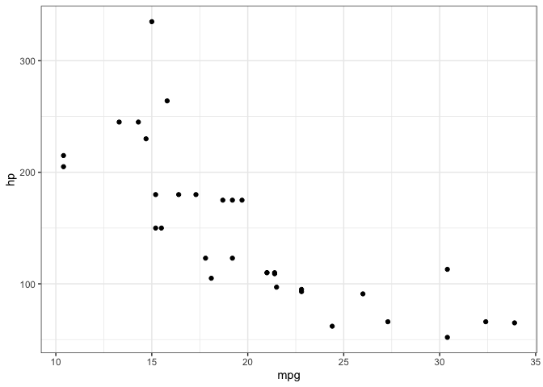

-   <a href="#quarto" id="toc-quarto">Quarto</a>
-   <a href="#running-code" id="toc-running-code">Running Code</a>
-   <a href="#creating-plots-as-well"
    id="toc-creating-plots-as-well">Creating Plots as well</a>
-   <a href="#printing-dataframes" id="toc-printing-dataframes">Printing
    Dataframes</a>

<script src="quarto-test_files/libs/kePrint-0.0.1/kePrint.js"></script>
<link href="quarto-test_files/libs/lightable-0.0.1/lightable.css" rel="stylesheet" />

## Quarto

Quarto enables you to weave together content and executable code into a
finished document. To learn more about Quarto see <https://quarto.org>.

## Running Code

When you click the **Render** button a document will be generated that
includes both content and the output of embedded code. You can embed
code like this:

<details>
<summary>Code</summary>

``` r
> 1 + 1
> x <- 1:10
> y <- rnorm(10)
> mod <- lm(y~x)
> summary(mod)
## [1] 2
## 
## Call:
## lm(formula = y ~ x)
## 
## Residuals:
##     Min      1Q  Median      3Q     Max 
## -2.5143 -0.3670  0.1136  0.5215  1.6742 
## 
## Coefficients:
##             Estimate Std. Error t value Pr(>|t|)
## (Intercept)   0.8282     0.8252   1.004    0.345
## x            -0.1056     0.1330  -0.794    0.450
## 
## Residual standard error: 1.208 on 8 degrees of freedom
## Multiple R-squared:  0.07311,    Adjusted R-squared:  -0.04275 
## F-statistic: 0.631 on 1 and 8 DF,  p-value: 0.4499
```

</details>

You can add options to executable code like this

    [1] 4

The `echo: false` option disables the printing of code (only output is
displayed).

<!-- $$
\int_{a}^b \exp(x) \,\mathrm{d}x = \frac{1}{1 + \frac{1}{1 + \frac{1}{1 + x}}}
$$ -->

Inline code seems to work okay 4

## Creating Plots as well

``` r
library(tidyverse)
```

    ── Attaching packages ─────────────────────────────────────── tidyverse 1.3.1 ──

    ✔ ggplot2 3.3.6     ✔ purrr   0.3.4
    ✔ tibble  3.1.8     ✔ dplyr   1.0.9
    ✔ tidyr   1.2.0     ✔ stringr 1.4.0
    ✔ readr   2.1.2     ✔ forcats 0.5.1

    ── Conflicts ────────────────────────────────────────── tidyverse_conflicts() ──
    ✖ dplyr::filter() masks stats::filter()
    ✖ dplyr::lag()    masks stats::lag()

``` r
mtcars |> ggplot(aes(mpg, hp)) +
  geom_point() + theme_bw()
```



## Printing Dataframes

I’d also like to customize how dataframes are printed, so I may have to
switch over to using `.mdx` components in order to get the styling that
I’d like on the tables.

<table class=" nord_table" style="margin-left: auto; margin-right: auto;">
 <thead>
  <tr>
   <th style="text-align:left;">   </th>
   <th style="text-align:right;"> mpg </th>
   <th style="text-align:right;"> cyl </th>
   <th style="text-align:right;"> disp </th>
   <th style="text-align:right;"> hp </th>
   <th style="text-align:right;"> drat </th>
   <th style="text-align:right;"> wt </th>
   <th style="text-align:right;"> qsec </th>
   <th style="text-align:right;"> vs </th>
   <th style="text-align:right;"> am </th>
   <th style="text-align:right;"> gear </th>
   <th style="text-align:right;"> carb </th>
  </tr>
 </thead>
<tbody>
  <tr>
   <td style="text-align:left;"> Mazda RX4 </td>
   <td style="text-align:right;"> 21.0 </td>
   <td style="text-align:right;"> 6 </td>
   <td style="text-align:right;"> 160 </td>
   <td style="text-align:right;"> 110 </td>
   <td style="text-align:right;"> 3.90 </td>
   <td style="text-align:right;"> 2.620 </td>
   <td style="text-align:right;"> 16.46 </td>
   <td style="text-align:right;"> 0 </td>
   <td style="text-align:right;"> 1 </td>
   <td style="text-align:right;"> 4 </td>
   <td style="text-align:right;"> 4 </td>
  </tr>
  <tr>
   <td style="text-align:left;"> Mazda RX4 Wag </td>
   <td style="text-align:right;"> 21.0 </td>
   <td style="text-align:right;"> 6 </td>
   <td style="text-align:right;"> 160 </td>
   <td style="text-align:right;"> 110 </td>
   <td style="text-align:right;"> 3.90 </td>
   <td style="text-align:right;"> 2.875 </td>
   <td style="text-align:right;"> 17.02 </td>
   <td style="text-align:right;"> 0 </td>
   <td style="text-align:right;"> 1 </td>
   <td style="text-align:right;"> 4 </td>
   <td style="text-align:right;"> 4 </td>
  </tr>
  <tr>
   <td style="text-align:left;"> Datsun 710 </td>
   <td style="text-align:right;"> 22.8 </td>
   <td style="text-align:right;"> 4 </td>
   <td style="text-align:right;"> 108 </td>
   <td style="text-align:right;"> 93 </td>
   <td style="text-align:right;"> 3.85 </td>
   <td style="text-align:right;"> 2.320 </td>
   <td style="text-align:right;"> 18.61 </td>
   <td style="text-align:right;"> 1 </td>
   <td style="text-align:right;"> 1 </td>
   <td style="text-align:right;"> 4 </td>
   <td style="text-align:right;"> 1 </td>
  </tr>
  <tr>
   <td style="text-align:left;"> Hornet 4 Drive </td>
   <td style="text-align:right;"> 21.4 </td>
   <td style="text-align:right;"> 6 </td>
   <td style="text-align:right;"> 258 </td>
   <td style="text-align:right;"> 110 </td>
   <td style="text-align:right;"> 3.08 </td>
   <td style="text-align:right;"> 3.215 </td>
   <td style="text-align:right;"> 19.44 </td>
   <td style="text-align:right;"> 1 </td>
   <td style="text-align:right;"> 0 </td>
   <td style="text-align:right;"> 3 </td>
   <td style="text-align:right;"> 1 </td>
  </tr>
  <tr>
   <td style="text-align:left;"> Hornet Sportabout </td>
   <td style="text-align:right;"> 18.7 </td>
   <td style="text-align:right;"> 8 </td>
   <td style="text-align:right;"> 360 </td>
   <td style="text-align:right;"> 175 </td>
   <td style="text-align:right;"> 3.15 </td>
   <td style="text-align:right;"> 3.440 </td>
   <td style="text-align:right;"> 17.02 </td>
   <td style="text-align:right;"> 0 </td>
   <td style="text-align:right;"> 0 </td>
   <td style="text-align:right;"> 3 </td>
   <td style="text-align:right;"> 2 </td>
  </tr>
  <tr>
   <td style="text-align:left;"> Valiant </td>
   <td style="text-align:right;"> 18.1 </td>
   <td style="text-align:right;"> 6 </td>
   <td style="text-align:right;"> 225 </td>
   <td style="text-align:right;"> 105 </td>
   <td style="text-align:right;"> 2.76 </td>
   <td style="text-align:right;"> 3.460 </td>
   <td style="text-align:right;"> 20.22 </td>
   <td style="text-align:right;"> 1 </td>
   <td style="text-align:right;"> 0 </td>
   <td style="text-align:right;"> 3 </td>
   <td style="text-align:right;"> 1 </td>
  </tr>
</tbody>
</table>
